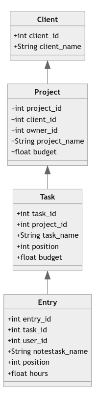

# pyTick: A WIP CLI Tickspot API wrapper

pyTick allows you to load entries to the tickspot platform

## Usage

~~~ bash
pyTick, A WIP CLI Tickspot API wrapper.

Usage:
    pytick.py --tasks 
    pytick.py --projects
    pytick.py new <task_id> <hours> [--note=<note>] [--date=<date>]
    pytick.py csv <filename>
    pytick.py (-h | --help)
    pytick.py --version

csv:
    filename    .csv file with the headers: date, hours, notes, task_id

Optional:
    --note=<string>   Note of entry.
    --date=<string>   Entry date.

Options:
    --tasks       Show all available tasks.
    --projects    Show all available projects.
    -h --help     Show this screen.
    --version     Show version.
~~~

To use it you need to load your credentials into a **creds.env** inside a parent directory:

~~~ python
userAgent="app_name (sample@email.com)"
accessword="your_password"
email="your_email@host.com"
token="yourTickspotToken"
userID=999999 
subscriptionID=999999
~~~

Your token can be get in the settings section of your account along with your subscriptionID. For your userID it is in the url of your account page.

## How does it work

It makes http requests as tick indicates in their [API documentation](https://github.com/tick/tick-api). Tick just sends and receives json. The ones i work here have a strcuture like this: 

**Be careful**, I added suffixes to make it more understandable. The figure mentions things like project_id but they just called id when they refer to de entity itself inside of the json file.

## Installation

Clone the repository and inside of the directory run:

~~~ bash
python pystick ...
~~~

### Dependencies

It requires:

~~~ python
dotenv
docopt
pandas
~~~

## Known issues

CSV files upload was tested ONLY on the script main directory, so paste them there to guarantee that it will run.

## ToDOs:

- [ ] Define contribution guide
- [ ] Feature to search entries by date, project id, task id...
- [ ] Find a more secure way to handle credentials
- [ ] Delete entries by their id
- [ ] Make it POSIX compliant
- [ ] Toggle http/https?